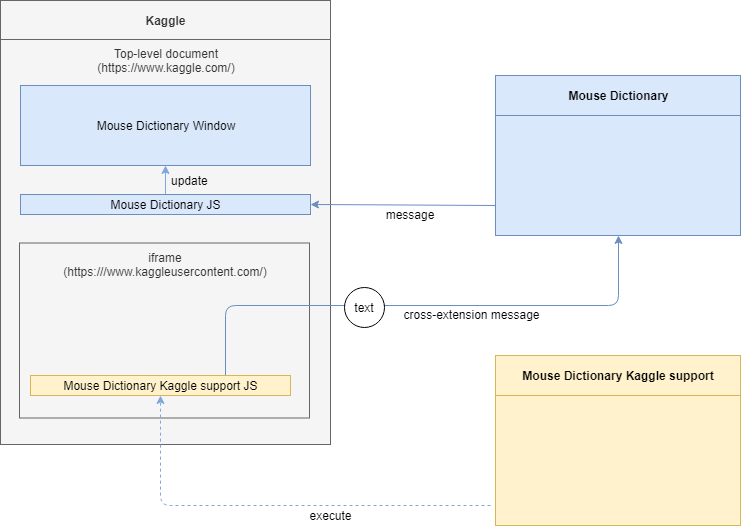

# Mouse Dictionary Enhancer

This extension is an add-on for [Mouse Dictionary](https://github.com/wtetsu/mouse-dictionary), making it usable on more websites.

Download:

- [Mouse Dictionary iframe Support](https://chrome.google.com/webstore/detail/nigglogmamjbcnljijokibobpcfgmdfn)
  - Add iframe support on any sites
  - Requires "<all_urls>" permission

- [Mouse Dictionary Kaggle Support](https://chrome.google.com/webstore/detail/bepofoammpdjhfdibmlghoaljkemineg)
  - Add Kaggle support
  - Requires only "https://www.kaggleusercontent.com/*" permission

## About Kaggle

[Kaggle](https://www.kaggle.com/) is a typical site that has main contents in cross-origin iframes. Mouse Dictionary doesn't work on such iframes by default.

Mouse Dictionary Kaggle Support enables Mouse Dictionary in cross-origin iframes on Kaggle.

## How it works in iframe

**Mouse Dictionary iframe Support** sends cross-extension messages to Mouse Dictionary.

## Third-party data

This project includes some third-party data:

### Images

- [WPZOOM Developer Icon Set](https://www.iconfinder.com/iconsets/wpzoom-developer-icon-set) ([CC BY-SA 3.0](https://creativecommons.org/licenses/by-sa/3.0/))

### Great JavaScript libraries

- See [package.json](./package.json) and [license.json](https://github.com/wtetsu/mouse-dictionary-enhancer/actions/workflows/license.yml)

## License

MIT
