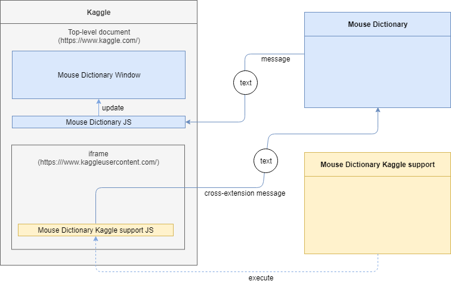

# Mouse Dictionary Enhancer

This extension is an add-on for [Mouse Dictionary](https://github.com/wtetsu/mouse-dictionary), which makes it available inside more sites.

* iframes (including Kaggle)
* Google Docs

Download:

- [Mouse Dictionary Enhancer](https://chrome.google.com/webstore/detail/nigglogmamjbcnljijokibobpcfgmdfn)
  - Add iframe support on any sites
  - Add Google Docs support
  - Requires "<all_urls>" permission

- [Mouse Dictionary Kaggle Support](https://chrome.google.com/webstore/detail/bepofoammpdjhfdibmlghoaljkemineg)
  - Add Kaggle support
  - Requires only "https://www.kaggleusercontent.com/*" permission

## About Kaggle

[Kaggle](https://www.kaggle.com/) is a typical site that uses cross-origin iframes for its important contents. Mouse Dictionary doesn't work on such iframes by default.

If you want to use Mouse Dictionary on Kaggle, just install **Mouse Dictionary Kaggle support** that is an add-on to enables Mouse Dictionary in cross-origin iframes on Kaggle.

- [Mouse Dictionary Kaggle support](https://chrome.google.com/webstore/detail/mouse-dictionary-iframe-s/bepofoammpdjhfdibmlghoaljkemineg)

Mouse Dictionary Kaggle support is built from this **Mouse Dictionary iframe support** project.

## How it works in iframe

**Mouse Dictionary iframe support** sends cross-extension messages to Mouse Dictionary.

## Google Docs support

In 2021, Google announced [Google Docs is migrated to a canvas-based rendering](https://workspaceupdates.googleblog.com/2021/05/Google-Docs-Canvas-Based-Rendering-Update.html). This migration impacts Chrome extensions that is designed to work on HTML document. Mouse Dictionary is no exception.

Mouse Dictionary Enhancer has a feature that makes Mouse Dictionary available on Google Docs again.

Note that this is just a workaround. Probably, HTML rendering of Google Docs will be completely abolished in the future and Chrome extensions that work on HTML documents will be obsoleted on Google Docs.

## Third-party data

This project includes some third-party data:

### Images

- [WPZOOM Developer Icon Set](https://www.iconfinder.com/iconsets/wpzoom-developer-icon-set) ([CC BY-SA 3.0](https://creativecommons.org/licenses/by-sa/3.0/))

### Great JavaScript libraries

- See [package.json](./package.json) and [license.json](https://github.com/wtetsu/mouse-dictionary-enhancer/actions/workflows/license.yml)

## License

MIT
